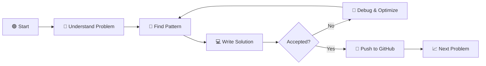

# 🧠 LeetCode Journey

<div align="center">

# 🚀 Solving Problems. Learning Patterns. Building Logic.

### My personal archive of LeetCode solutions and DSA progress.

<br>


</div>

---

## ⚡ About This Repository

This repository automatically stores my accepted **LeetCode solutions**.

Every problem I solve becomes part of my long-term DSA journey. The purpose is not simply to collect solved questions, but to improve:

```text
🧩 Problem Solving
       ↓
🔍 Pattern Recognition
       ↓
⚙️ Algorithmic Thinking
       ↓
🚀 Better Coding Skills
```

---

## 🗺️ My Problem-Solving Journey



---

# 🧠 DSA Roadmap

```text
                    ┌─────────────────┐
                    │   DSA JOURNEY   │
                    └────────┬────────┘
                             │
        ┌────────────────────┼────────────────────┐
        │                    │                    │
     🟢 Basics            🟡 Core              🔴 Advanced
        │                    │                    │
   ┌────┴────┐         ┌────┴────┐         ┌────┴────┐
   │ Arrays  │         │ Trees   │         │ Graphs  │
   │ Strings │         │ Linked  │         │ Dynamic │
   │ Hashing │         │ Lists   │         │ Program │
   │ Stack   │         │ Queues  │         │ Backtrack│
   └─────────┘         └─────────┘         └─────────┘
```

---

## 📂 Repository Structure

```text
LeetCode/
│
├── 0001-two-sum/
│   └── solution.js
│
├── 0136-single-number/
│   └── solution.js
│
├── 0206-reverse-linked-list/
│   └── solution.js
│
└── More problems coming...
```

> Each folder represents a LeetCode problem that I have successfully solved.

---

# 🎯 Topics I'm Mastering

<table>
<tr>
<td width="50%">

### 🟢 Foundation

* [x] Arrays
* [x] Strings
* [x] Hashing
* [x] Basic Math
* [ ] Recursion
* [ ] Binary Search

</td>

<td width="50%">

### 🟡 Intermediate

* [ ] Linked Lists
* [ ] Stacks
* [ ] Queues
* [ ] Trees
* [ ] Sliding Window
* [ ] Two Pointers

</td>
</tr>

<tr>
<td width="50%">

### 🔵 Advanced

* [ ] Graphs
* [ ] Heaps
* [ ] Greedy Algorithms
* [ ] Backtracking

</td>

<td width="50%">

### 🔴 Expert Level

* [ ] Dynamic Programming
* [ ] Tries
* [ ] Advanced Graphs
* [ ] Advanced DP

</td>
</tr>
</table>

---

# 📈 The Goal

```text
┌───────────────────────────────────────────────┐
│                                               │
│        1 Problem                             │
│            ↓                                  │
│        Learn Pattern                         │
│            ↓                                  │
│        Solve Similar Problems                │
│            ↓                                  │
│        Build Intuition                       │
│            ↓                                  │
│        Become Better Every Day 🚀             │
│                                               │
└───────────────────────────────────────────────┘
```

---

## 🔥 Philosophy

> Don't memorize solutions.
> Understand the pattern.

> Don't chase only numbers.
> Build problem-solving ability.

> Don't stop after getting Accepted.
> Understand why it works.

---

<div align="center">

# 🚀 Keep Solving. Keep Learning. Keep Improving.

### Every solved problem is one more pattern understood.

<br>

**⭐ If you find this repository useful, feel free to star it!**

</div>

<!---LeetCode Topics Start-->
# LeetCode Topics
## Math
|  |
| ------- |
| [0050-powx-n](https://github.com/govind-codex/LeetCode/tree/master/0050-powx-n) |
## Recursion
|  |
| ------- |
| [0050-powx-n](https://github.com/govind-codex/LeetCode/tree/master/0050-powx-n) |
<!---LeetCode Topics End-->